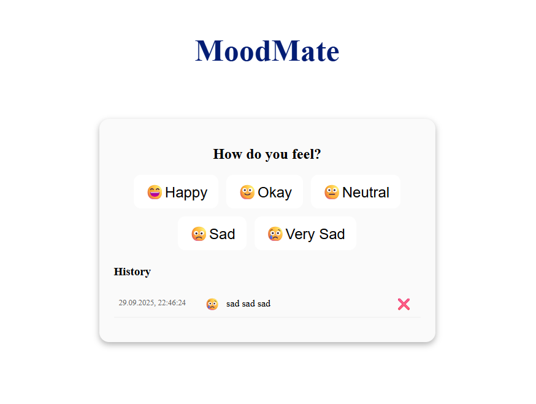

# MoodMate

MoodMate is a simple Angular application that allows users to select their current mood.  
The app stores the selected mood in the browser's localStorage, so the choice persists even after refreshing the page.

## Features

- Choose your mood: 😃 Happy, 🙂 Okay, 😐 Neutral, 🙁 Sad, 😢 Very Sad  
- Mood is saved in localStorage for persistence  
- Built with Angular 15+ standalone components  

## Project Structure

src/
├─ app/
│ ├─ app.ts # Main AppComponent
│ ├─ app.html # Main template
│ ├─ app.scss # Global styles
│ ├─ components/
│ │ └─ mood-selector/
│ │ ├─ mood-selector.ts # MoodSelector standalone component
│ │ ├─ mood-selector.html # Template for MoodSelector
│ │ └─ mood-selector.scss # Styles for MoodSelector

## Technologies Used

- Angular 15+ (Standalone Components)  
- SCSS for styling  
- Browser localStorage for saving selected mood  

## Technical Highlights

- Uses Angular **Signals** (`signal` and `effect`) for reactive state management  
- MoodSelector is a **standalone component**, imported directly into AppComponent  
- Clean separation of concerns: AppComponent handles the page, MoodSelector handles mood selection  

## Demo

